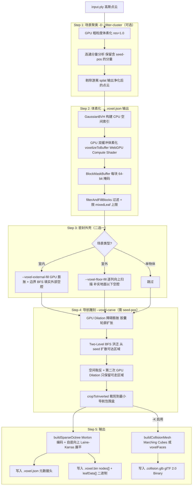

# splat-transform 体素碰撞生成：格式规范 · 命令参数 · 流程详解

> **信息来源（双真相源）**
> - 官方文档：[Collision Mesh Generation](https://developer.playcanvas.com/user-manual/splat-transform/collision/) · [Voxel Format](https://developer.playcanvas.com/user-manual/splat-transform/voxel-format/)
> - 代码实现：`src/cli/index.ts` · `src/lib/writers/write-voxel.ts` · `src/lib/writers/sparse-octree.ts` · `src/lib/writers/collision-glb.ts` · `src/lib/voxel/sparse-voxel-grid.ts` · `src/lib/voxel/voxelize.ts` · `src/lib/voxel/carve.ts`
>
> 分析日期：2026-07-18

---

## 一、概述

splat-transform 从 Gaussian Splat（.ply）生成三类碰撞文件：

| 文件 | 格式 | 用途 |
|------|------|------|
| `*.voxel.json` | JSON 元数据 | 描述稀疏八叉树结构（包围盒、分辨率、节点计数） |
| `*.voxel.bin` | 二进制 Uint32 | 稀疏八叉树节点数组 + 混合叶掩码数组 |
| `*.collision.glb` | glTF 2.0 Binary | 三角面碰撞网格（可选，`-K` 启用） |

前两个文件被 `supersplat-viewer` 的 `VoxelCollision` 运行时直接消费，驱动 Walk 模式的实时碰撞检测。

---

## 二、体素碰撞文件格式规范（v1.1）

### 2.1 文件命名约定

```
scene.voxel.json      ← 元数据头（本规范描述）
scene.voxel.bin       ← 二进制八叉树数据
scene.collision.glb   ← 可选三角网格
```

读取方规则：从 `.voxel.json` 路径替换后缀得到 `.voxel.bin` 路径，头文件中不显式引用二进制文件名。

---

### 2.2 `*.voxel.json` — 元数据头

TypeScript 接口定义（来自官方规范 + 代码实现一致）：

```typescript
interface VoxelMeta {
    version: string;           // 文件格式版本，如 "1.1"
    asset?: {
        generator?: string;    // 生成工具，如 "splat-transform v2.5.2"
    };
    gridBounds: {              // 体素网格 AABB，对齐到 4-体素块边界
        min: number[];         // [x, y, z] 世界坐标 min 角
        max: number[];         // [x, y, z] 世界坐标 max 角
    };
    sceneBounds: {             // 原始高斯场景 AABB（仅供参考）
        min: number[];
        max: number[];
    };
    voxelResolution: number;   // 单个体素边长（世界单位）
    leafSize: number;          // 叶块维度（恒为 4，即 4×4×4 = 64 体素/叶）
    treeDepth: number;         // 根节点到叶块的细分层数（>= 1）
    numInteriorNodes: number;  // 内部节点数
    numMixedLeaves: number;    // 混合叶节点数
    nodeCount: number;         // nodes[] 数组的 Uint32 个数
    leafDataCount: number;     // leafData[] 数组的 Uint32 个数 (= 2 × numMixedLeaves)
}
```

**字段语义说明：**

| 字段 | 说明 |
|------|------|
| `gridBounds` | 体素数据的权威坐标系。体素 (vx,vy,vz) 对应世界空间：`min + (vx,vy,vz) × voxelResolution` 到 `min + (vx+1,vy+1,vz+1) × voxelResolution`。每轴均为 4×4×4 块的整数倍。 |
| `sceneBounds` | 原始高斯场景包围盒（每个高斯以其旋转缩放后的 sigma 截断范围展开）。仅供参考——经过填充/雕刻/裁剪后，`gridBounds` 可能大于或小于 `sceneBounds`。 |
| `nodeCount` | = `numInteriorNodes` + `numMixedLeaves` + 实心叶数（实心叶数不单独存储）。 |
| `leafDataCount` | 恒为 `2 × numMixedLeaves`（每个混合叶存一对 lo/hi Uint32）。 |

**版本历史：**

| 版本 | 坐标系 | 说明 |
|------|--------|------|
| 1.0 | PLY 源坐标系 | 体素化在 PLY 原始坐标系中执行 |
| **1.1** | **PlayCanvas 引擎坐标系** | 相比 PLY 绕 Z 轴旋转 180°（引擎标准 splat 导入变换）。二进制布局不变。 |

> **兼容性规则**：读取方遇到主版本号 > 1 应拒绝；未知字段应忽略（允许小版本向后兼容扩展）。`asset` 块在部分早期 1.1 文件中可能缺失。
> v1.0 文件用 `FlippedVoxelCollision` 加载（X/Y 轴取反），由 supersplat-viewer 自动处理。

**示例**（32×14×32 块，0.05m 分辨率，块大小 0.2m）：

```json
{
    "version": "1.1",
    "asset": { "generator": "splat-transform v2.5.2" },
    "gridBounds": {
        "min": [-3.2, -0.2, -3.2],
        "max": [3.2, 2.6, 3.2]
    },
    "sceneBounds": {
        "min": [-3.13, -0.08, -3.07],
        "max": [3.11, 2.49, 3.08]
    },
    "voxelResolution": 0.05,
    "leafSize": 4,
    "treeDepth": 5,
    "numInteriorNodes": 1201,
    "numMixedLeaves": 5678,
    "nodeCount": 9232,
    "leafDataCount": 11356
}
```

---

### 2.3 `*.voxel.bin` — 二进制八叉树

**布局（无头，无填充）：**

```
┌─────────────────────────────────────────────────────┐
│  Offset 0                   Length: nodeCount × 4   │
│  nodes[]          Uint32 数组，小端序                │
├─────────────────────────────────────────────────────┤
│  Offset nodeCount×4         Length: leafDataCount×4 │
│  leafData[]       Uint32 数组，小端序                │
└─────────────────────────────────────────────────────┘
总大小 = (nodeCount + leafDataCount) × 4 字节
```

空场景：nodeCount=0，leafDataCount=0，二进制文件为空。

---

### 2.4 八叉树节点编码（Laine-Karras 格式）

每个 nodes[i] = 1 个 Uint32，按以下顺序判断类型：

```
┌──────────┬────────────────────────────┐
│ 31..24   │  23..0                     │
│ childMask│  firstChild / leafDataIdx  │
│ (8 bit)  │  (24 bit)                  │
└──────────┴────────────────────────────┘
```

| 判断条件 | 节点类型 | 含义 |
|----------|----------|------|
| `word === 0xFF000000` | **实心叶** | 整个体积全部实心。可出现在任意深度（已折叠的全实心子树）。无子节点，无叶数据。 |
| `(word >>> 24) === 0` | **混合叶** | `word & 0xFFFFFF` = leafData 中的索引 i；掩码为 `leafData[2i]`（lo）和 `leafData[2i+1]`（hi）。**仅出现在深度 treeDepth。** |
| 否则 | **内部节点** | `childMask = word >>> 24`，`firstChild = word & 0xFFFFFF` |

**两种叶类型无歧义的原因：**
- 内部节点至少有一个子节点，所以 childMask 永不为 0 → 高字节为 0 唯一标识混合叶
- 节点按广度优先顺序存储，子节点总在父节点之后，所以内部节点的 firstChild 永不为 0 → `0xFF000000` 唯一标识实心叶

**卦象编号（x 最低位）：**

```
oct = x | (y << 1) | (z << 2)    // x, y, z = 0 为下半，1 为上半
```

**子节点定位：**

```typescript
// 定位 octant oct 对应的子节点：
const childOffset = popcount(childMask & ((1 << oct) - 1))
const childNodeIdx = firstChild + childOffset
// childMask 某位为 0 → 该卦象整体为空，无节点存储
```

---

### 2.5 混合叶 64-bit 体素掩码

混合叶的 4×4×4 = 64 个体素存为一对 Uint32（lo = bits 0-31，hi = bits 32-63）：

```typescript
// 局部坐标 (lx, ly, lz) ∈ [0, 4) 对应的位索引：
const bit = lx + (ly << 2) + (lz << 4)
// 读取体素状态：
const solid = bit < 32
    ? (leafData[2*i]     >>> bit)       & 1
    : (leafData[2*i + 1] >>> (bit - 32)) & 1

// 掩码约束：不会全0（空节点不存储）也不会全1（改为实心叶编码）
```

---

### 2.6 `*.collision.glb` — 碰撞三角网格（可选）

标准 glTF 2.0 Binary，最小化内容：

- 单 Mesh，单 Primitive
- 只含 `POSITION`（Float32，VEC3）和三角形索引（UNSIGNED_INT）
- **无法线、无 UV、无材质**（仅用于碰撞，不参与渲染）
- 生成模式：`smooth`（Marching Cubes + 共面合并）或 `faces`（体素面直提）

**两种模式对比：**

| | `smooth`（默认） | `faces` |
|-|-----------------|---------|
| 算法 | Marching Cubes 等值面 + 共面三角形合并 | 直接提取暴露的体素外表面 |
| 三角形数量 | 少（合并后显著压缩） | 多（精确体素边界） |
| 形状 | 平滑自然轮廓 | 精确轴对齐体素面 |
| 适用场景 | 角色碰撞（运行时） | 需要与体素光线投射严格对齐的调试碰撞 |

---

### 2.7 查询域约定

**格外空间 = 实心**：碰撞消费方（如 SuperSplat Viewer）将 gridBounds 之外的空间视为实心。写入方利用此约定：经导航选项处理后，gridBounds 之外的全实心块被裁剪掉，精确减小文件大小。

**格外上限：** `firstChild` 和 mixedLeaf leafData 索引均为 24 位，限制格式上限为 16,777,216 个节点和 16,777,216 个混合叶。写入方在超出时报错，而非截断。

---

## 三、CLI 命令参数详解

### 3.1 参数总表

| 参数 | 短参 | 默认值 | 含义 |
|------|------|--------|------|
| `--filter-cluster [res,op,min]` | `-D` | 禁用 | 预处理：粗体素化 + 连通分量提取，去除游离 splat |
| `--seed-pos <x,y,z>` | — | `0,0,0` | 所有 BFS/洪泛阶段的世界空间起点 |
| `--voxel-params [size,opacity]` | — | `0.05,0.1` | 体素分辨率 + 透明度阈值 |
| `--voxel-external-fill [size]` | — | `1.6` | 室内场景：填实外部空腔，保留内部可导航区域 |
| `--voxel-floor-fill [size]` | — | `1.6` | 室外场景：逐列向上填实地面以下空腔 |
| `--voxel-carve [h,r]` | — | `1.6,0.2` | 从 seed-pos 以胶囊轮廓洪泛，只保留可到达空间 |
| `--collision-mesh [smooth\|faces]` | `-K` | 禁用 | 生成 `.collision.glb` 三角网格 |

### 3.2 `--filter-cluster` 参数（Step 1 预处理）

```
-D, --filter-cluster [res,op,min]
```

| 子参数 | 默认值 | 含义 |
|--------|--------|------|
| `res` | `1.0` | 粗网格体素边长（世界单位）。越大越快，但对间隙更宽容 |
| `op` | `0.999` | 认为体素为实心的透明度阈值 |
| `min` | `0.1` | 保留 splat 所需的最小高斯贡献值 |

作用：GPU 粗粒度体素化 → 找到包含 `--seed-pos` 的连通分量 → 丢弃其他分量的 splat。也可单独使用过滤输出（无需体素输出）。

### 3.3 `--voxel-params` 参数（Step 2 体素化）

```
--voxel-params [size,opacity]
```

| 子参数 | 默认值 | 含义 |
|--------|--------|------|
| `size` | `0.05` | 体素边长（世界单位）。越小精度越高，文件越大，填充越慢 |
| `opacity` | `0.1` | 将体素标记为实心所需的最小 splat 透明度 |

### 3.4 `--voxel-external-fill` 参数（Step 3，室内场景）

```
--voxel-external-fill [size]
```

| 子参数 | 默认值 | 含义 |
|--------|--------|------|
| `size` | `1.6` | 填充前的膨胀距离（世界单位）。用于封闭墙壁的小洞。若墙有噪声穿孔，增大此值。 |

原理：膨胀实心网格 → 从包围盒边界向内 BFS 洪泛 → 将外部可到达的所有体素标记为实心 → 只保留内部封闭区域为空（可导航）。若 seed 从外部可到达（即场景实际上未封闭），整个 fill 会被跳过。

### 3.5 `--voxel-floor-fill` 参数（Step 3，室外场景）

```
--voxel-floor-fill [size]
```

| 子参数 | 默认值 | 含义 |
|--------|--------|------|
| `size` | `1.6` | 限制修补范围：只修补周围 `2×size` 范围内有地面的 XZ 列。大型外部空旷区域（如天空）不会被意外填充。 |

原理：逐 XZ 列从包围盒底部向上扫描，遇到实心体素之前的空体素全部填实，即使没有 splat 也能生成地面体积。

### 3.6 `--voxel-carve` 参数（Step 4，导航雕刻）

```
--voxel-carve [h,r]
```

| 子参数 | 默认值 | 含义 |
|--------|--------|------|
| `h` | `1.6` | 胶囊高度（世界单位），近似智能体高度。设为 `0` 禁用雕刻。 |
| `r` | `0.2` | 胶囊半径（世界单位），近似智能体半径。 |

**与 supersplat-viewer 参数对应：**

| splat-transform | supersplat-viewer | 值 |
|-----------------|-------------------|----|
| `--voxel-carve 1.6,0.2` | `capsuleHeight=1.5, capsuleRadius=0.2` | 雕刻尺寸略大于胶囊（留 hoverHeight=0.2m 余量）|
| `--voxel-size 0.05` | `DEFAULT_VOXEL_RESOLUTION=0.05` | **必须一致** |
| `--seed-pos` | walk 模式出生点 | 应在同一位置附近 |

### 3.7 `--seed-pos` 参数（共享）

`--seed-pos <x,y,z>`，默认 `0,0,0`。

被以下三个阶段消费：
1. `--filter-cluster` — 选择包含此点的连通分量
2. `--voxel-external-fill` — 若 seed 从外部可到达则跳过填充
3. `--voxel-carve` — 胶囊洪泛的起点

### 3.8 场景类型选择指南

```
室内封闭场景（房间、走廊）:
  --filter-cluster --seed-pos 0,1,0
  --voxel-external-fill --voxel-carve -K

室外地形场景:
  --filter-cluster --seed-pos 0,0,0
  --voxel-floor-fill -K

孤立空间中的单个物体:
  (跳过 fill，可选 --voxel-carve)

高精度体素面碰撞网格（调试）:
  --voxel-params 0.025,0.1 -K faces
```

---

## 四、完整生成流程

### 4.1 五阶段 Pipeline 总览



### 4.2 完整命令行示例

**室内房间扫描：**
`ash
splat-transform room.ply \
    --filter-cluster --seed-pos 0,1,0 \
    room.voxel.json \
    --voxel-external-fill \
    --voxel-carve \
    -K
`

**室外地形：**
`ash
splat-transform terrain.ply \
    --filter-cluster --seed-pos 0,0,0 \
    terrain.voxel.json \
    --voxel-floor-fill \
    -K
`

**高精度体素面碰撞网格（调试）：**
`ash
splat-transform input.ply \
    output.voxel.json --voxel-params 0.025,0.1 -K faces
`

---

## 五、各阶段实现细节

### 5.1 GPU 体素化双缓冲流水线

双缓冲机制：CPU 准备下一批 BVH 查询结果（slot A）时，GPU 同步执行上一批 Compute Shader（slot B），GPU 利用率接近 100%。

D3D12 TDR 保护：单次 mega-flush 上限（256 批 / 2M 索引）确保 GPU 单次 Compute 分发在 Windows D3D12 2秒看门狗内完成。

**批次分配流程：**
1. 按 batchSize=16 块 × 16 × 16 对网格分批
2. 每个批次：BVH.queryOverlappingRawInto(批次 AABB) → 候选高斯索引列表
3. 累积到当前 slot 的 indexArray
4. 达到阈值（256 批 或 2M 索引）→ submitMultiBatch() → GPU Compute
5. GPU 输出每块 [lo, hi] Uint32 对 → processResults 写入 BlockMaskBuffer

### 5.2 SparseVoxelGrid 数据结构

2-bit 紧凑类型打包（16 块/Uint32 word）：

`
块 i → types[i >>> 4] 的 bit [(i & 15) << 1] 起的 2 bit
EMPTY=0b00  SOLID=0b01  MIXED=0b10

快速非空检测（word-skip）：
  nonEmpty = (word & 0x55555555) | ((word >>> 1) & 0x55555555)
  // lane k 非空 → bit(2k) = 1，可用 clz32 快速定位
`

内存效率：旧方案 9 bit/块，新方案 2 bit/块，节省约 4.5 倍。
MIXED 块的 64-bit 掩码存在 BlockMaskMap 哈希表中（以块线性索引为 key）。

### 5.3 外部填充 fillExterior（室内场景）

适用：室内封闭场景，如房间、走廊。

算法步骤：
1. GPU 3D Dilation：膨胀 size 世界单位，封闭墙壁小洞
2. BFS 洪泛：从包围盒 6 个面的边界格向内扩散，绕过膨胀后的实心区域
3. 若 seed-pos 从外部可到达 → 跳过 fill（场景未封闭）
4. BFS 可到达格全部标记为实心（外部区域 = 实心）
5. 输出：只有内部封闭区域保持为空格（可导航）

### 5.4 地板填充 fillFloor（室外场景）

适用：室外场景、地形。

算法步骤：
1. 若 floorFillDilation > 0：GPU 水平 XZ 膨胀，标记"内部"XZ 列（距实心体素 dilation 格以内）
2. 逐 XZ 列从包围盒底部向上扫描
3. 遇到实心体素之前的空体素全部设为实心
4. size 参数：只修补周围 2×size 范围内有地面的列，大型外部空旷区域（如天空）不受影响

### 5.5 胶囊雕刻 carve（核心导航步骤）

**算法：**
1. 参数计算：kernelR = ceil(r/voxelRes)，yHalfExtent = ceil(h/(2×voxelRes))
2. GPU 3D Dilation（XY 圆盘 + Y 轴额外半高）：障碍物向外膨胀 kernelR 格 = 胶囊中心不可达区域
3. 若 seed 被阻塞 → findNearestFreeCell 扩展壳搜索最近空格，更新 seed
4. Two-Level BFS：块级粗粒度 → 体素级精确，从 seed 扩散所有可到达格 → navGrid
5. computeEmptyGrid：可达=0，障碍=1（取反）
6. 第二次 GPU Dilation：对空格区域膨胀，确保胶囊边缘被覆盖
7. cropToInverted：空格→实心，实心→空格，裁剪到最小包围盒

Two-Level BFS 优化：先块级粗粒度 BFS 快速跳过完全空的块，只对候选块做体素级精确 BFS，降低内存开销。

### 5.6 稀疏八叉树构建三阶段

**Phase 1：Morton 编码 + 排序**
- Pass 1：word-skip 扫描 types[]，统计 nSolid, nMixed
- Pass 2：为每个非空块计算 xyzToMorton(bx,by,bz)，填入 solidStream（Float64）和 mixedStream（Float64 + 64-bit 掩码对）
- 排序：solidStream.sort()（原生，无 compareFn）；sortKeyMaskPairs(mixedStream)（自定义快排，绕开 V8 FixedArray 134M 上限）
- 特殊路径：solid 块极多（>=8M 且 > mixed×4 且占总块 25%+）→ buildSparseOctreeDense（密集 Mip 构建）

**Phase 2：自底向上逐层合并**
- Level 0：solidStream + mixedStream（双流，Morton 有序）
- Level 1：双指针合并，以 floor(morton/8) 分组；全 8 子实心 → SOLID collapse；否则 MIXED（保留 childMask）
- Level 2..N：单流线性扫描，重复合并，直到剩 1 个根节点
- 构建期 SoA：interiorLevels[li] = { mortons: Float64[], types: Uint8[], childMasks: Uint8[] }

**Phase 3：BFS 展平为 Laine-Karras 格式**
- 从根节点 BFS，按广度优先顺序写入 nodes[]
- SOLID 节点 → nodes[pos] = 0xFF000000
- MIXED 叶 → leafData[2i] = lo, [2i+1] = hi；nodes[pos] = i
- 内部节点 → nodes[pos] = 占位 0；子节点写完后回填 (childMask << 24) | firstChild
- 保证：父节点 baseOffset 永远 < 任何子节点位置

### 5.7 碰撞网格生成 buildCollisionMesh

**smooth 路径（默认）：**
1. marchingCubes(grid, gridBounds, voxelResolution, { mergeFlatFaces: true }) — 等值面提取
2. coplanarMerge(preMergedMesh, voxelResolution) — 共面三角形合并（典型减少 30-70%）
3. encodeGlb(positions, indices) — 封装 glTF 2.0 Binary

**faces 路径：**
1. voxelFaces(grid, gridBounds, voxelResolution) — 直接提取暴露的体素外表面
2. encodeGlb(positions, indices)

GLB 内部：JSON Chunk（最小化 glTF 描述）+ BIN Chunk（Float32 positions || Uint32 indices），无法线/UV/材质。

---

## 六、与 supersplat-viewer 运行时对接

| splat-transform 参数 | supersplat-viewer 对应值 | 说明 |
|---------------------|------------------------|------|
| --voxel-carve 1.6,0.2 | capsuleHeight=1.5, capsuleRadius=0.2 | 雕刻尺寸略大于胶囊（hoverHeight=0.2m 余量）|
| --voxel-params 0.05 | DEFAULT_VOXEL_RESOLUTION=0.05 | **必须一致**，否则碰撞坐标错位 |
| --seed-pos x,y,z | walk 模式出生点 | 应在同一位置附近 |
| version 1.0 | FlippedVoxelCollision | X/Y 坐标取反，兼容 PLY 坐标系 |
| version 1.1 | VoxelCollision | PlayCanvas 引擎坐标系（绕 Z 旋转 180°）|

运行时碰撞查询使用：
- queryRay() — Slab 测试 + DDA 逐格步进（无浮点漂移）
- queryCapsule() → resolveIterative() — 最多 4 次迭代约束投影，处理最多 3 个接触面法线

---

## 七、常见问题排查

| 问题 | 原因 | 解决方法 |
|------|------|----------|
| carve 无输出 | seed-pos 在实心几何内，或胶囊太大 | 移动 seed 到空旷位置，或缩小 h,r |
| external-fill 从墙壁漏出 | 墙壁有噪声小洞 | 增大 --voxel-external-fill size，或降低 opacity |
| carve 泄漏到相邻房间 | 墙壁太薄或有缝隙 | 降低 --voxel-params size，或增大 external-fill size |
| 碰撞网格三角数过多 | 使用了 faces 模式 | 改用 -K smooth，或粗化 voxel-params size |
| filter-cluster 选错分量 | seed-pos 不在目标分量 | 将 seed-pos 移入目标，或增大 res 参数 |
| 超出 24-bit 节点/叶限制 | 场景过大或分辨率过细 | 粗化 voxel-size，或缩小场景范围 |

---

## 八、格式上限与性能约束

| 约束 | 限制值 | 来源 |
|------|--------|------|
| 最大节点数 | 16,777,216（2²⁴） | Laine-Karras 24-bit firstChild |
| 最大混合叶数 | 16,777,216（2²⁴） | 24-bit leafData 索引 |
| 最大树深度 | 17 层 | Morton 编码精度 |
| 可变网格块数上限 | 2³² | SparseVoxelGrid 32-bit 块索引 |
| 可变网格峰值内存 | 1 GiB | MAX_MUTABLE_GRID_PEAK_BYTES |
| GPU TDR 保护 | 256 批 / 2M 索引 | 避免 D3D12 2s 看门狗 |

---

## 九、设计亮点

1. **双缓冲 GPU 流水线**：CPU 准备 BVH 查询时 GPU 同步执行体素化，GPU 利用率接近饱和
2. **2-bit 紧凑打包 + word-skip**：大规模空场景遍历接近 O(非空块数)
3. **Morton 排序 + 自定义快排**：绕开 V8 compareFn 路径的 134M 上限
4. **SOLID collapse 折叠**：构建期全实心父节点自动提升，显著压缩节点数
5. **Dense Mip 路径**：实心块极多时切换密集 Mip 构建，内存更优
6. **导航感知裁剪**：利用"格外 = 实心"运行时约定，仅存储含空体素的最小包围盒
7. **两种叶类型无歧义**：BFS 广度优先布局 + 0xFF000000 Sentinel，无需额外类型位

---

*报告生成：宪宪/claude-opus-4-6🐾 · 2026-07-18*
*数据来源：PlayCanvas 官方文档 + splat-transform 源码深度分析*
